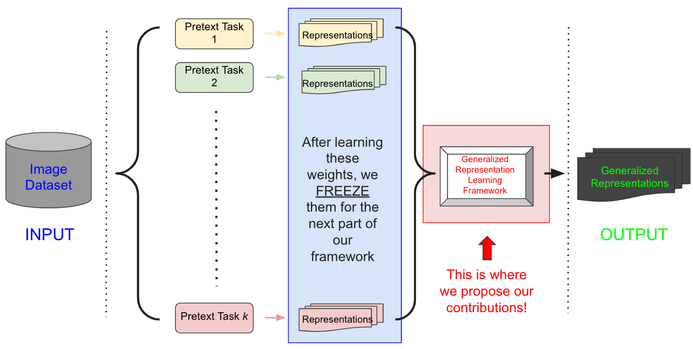

## Teaching a robotic guide dog to walk 
  
__[[report]](https://drive.google.com/file/d/1SOTqZE1FKn_cMCLk0z0W3LTs_vG2VwrT/view?usp=sharing)__  
Guide dogs take time to train and the skills learned are not transferrable. This is a part of a robotic guide dog project that teaches roboust locomotion policies that can walk naturally while battling external forces coming from the rigid harness attached to the dog, or possible collisions. We are also working on a method to read human intentions from the feedback coming from the harness, and associate it into robot actions. (e.g. stop, slow down)

## Learning generalizable representations by combining pretext tasks

__[[video]](https://youtu.be/HOde50FdKD8)__  
Self-supervised pretext tasks (e.g. rotation prediction, contrastive learning) learn representations from unlabeled data and uses them to solve downstream tasks such as classification, detection, and segmentation. Each pretext task learns different representations which are specific to a limited domain of downstream tasks. In this project we try to learn a domain agnostic generelizable representation that can give good performance on multiple downstream tasks. We tackle this task by leveraging the power of multiple self-supervised pretext tasks. We demonstrate one of the proposed approaches which uses an ensemble of multiple pretext tasks to make final predictions in the downstream tasks. 

## Interactive object grounding using semantic scene graphs

__[[paper]](https://arxiv.org/abs/2201.01901)__  
Understanding human command is an important process needed for effective human-robot communication. However, this is challenging because human commands can be ambiguous and erroneous. This project aims to disambiguate the human's referring expressions by allowing the agent to ask relevant questions based on semantic data obtained from scene graphs. We test if our agent can use relations between objects from a scene graph to ask semantically relevant questions that can disambiguate the original user command.

## PointNav - pointing gesture based robot navigation tool
  
(This is a project conducted while interning at SSIC)  
PointNav is an intuitive robot navigation tool that allows the robot to move to the area pointed by the user. It is an end-to-end software that uses a depth camera to detect hand gestures and uses body pose estimation to calculate the target coordinate the robot should move to. We test PointNav on a working prototype with a custom-build TurtleBot platform. 